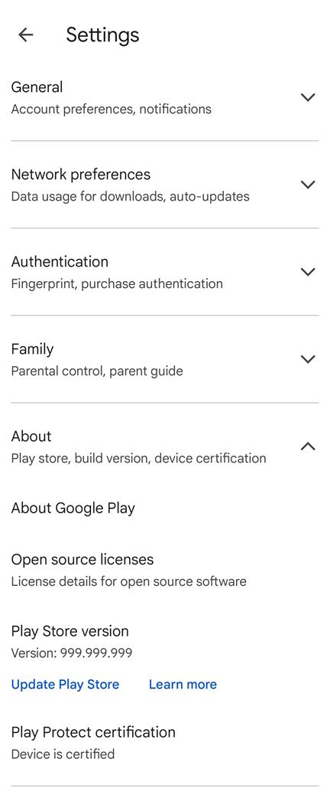

# PlaySpoofer
[中文](README_zh.md) | [English](README.md)

An Xposed module that modifies Google Play Store version information.

## 🚀 Features

This module spoofs the Google Play Store version information to:
- **Version Code**: 99999999  
- **Version Name**: "999.999.999"

This prevents the Google Play Store from automatically updating itself.

## 🔍 How to Verify PlaySpoofer is Working

1. Open the Google Play Store
2. Tap the profile icon in the top-right corner
3. Select "Settings" from the menu
4. Scroll down to find the "About" section
5. Verify the status:
   - **On older versions**: The version name should display as "999.999.999".
   - **On Play Store v47+**: The displayed version may NOT change. Click **"Update Play Store"**. If it says "**Google Play Store is up to date**", the module is working correctly.

  
  &nbsp;&nbsp;&nbsp;&nbsp;
  

> **📝 Note**: The version spoofing only affects the version information displayed within the Google Play Store app itself. If you check the version from external sources (such as device Settings > Apps), it will still show the original values.

## 📋 Requirements

- Rooted Android device
- Xposed Framework (LSPosed recommended)
- Android 9.0+

## 🔧 Installation

1. Download and install the APK file from [Releases](https://github.com/byemaxx/PlayVersionSpoofer/releases)
2. Enable the module in your LSPosed manager
3. Select "Google Play Store" as the target scope
4. Open the PlaySpoofer app to verify activation status

## ⚠️ Disclaimer

Educational use only. Use at your own risk.
