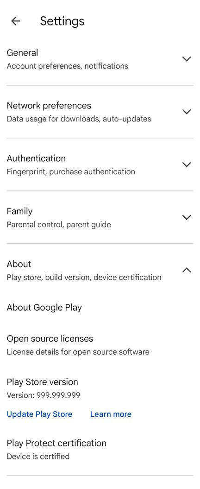
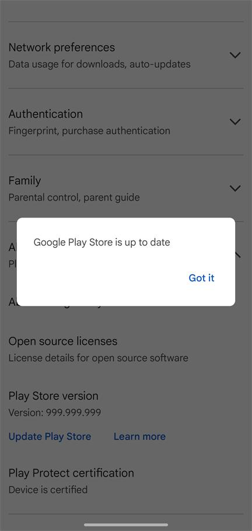

# PlaySpoofer
[中文](README_zh.md) | [English](README.md)

一个修改 Google Play 商店版本信息的 Xposed 模块。

## 🚀 功能特性

本模块能够伪装 Google Play 商店的版本信息：
- **版本号**: 99999999
- **版本名**: "999.999.999"

从而阻止 Google Play 商店自动更新。

## 🔍 如何验证 PlaySpoofer 是否正常工作

1. 打开 Google Play 商店
2. 点击右上角的个人资料图标
3. 从菜单中选择"设置"
4. 向下滚动找到"关于"部分
5. 验证状态：
   - **旧版本**：版本号应显示为 "999.999.999"。
   - **Play Store v47+**：显示的版本号可能不会变化。请点击 **"更新 Play 商店"**。如果提示 **"Google Play 商店已是最新版本"**，则说明模块工作正常。

  
  &nbsp;&nbsp;&nbsp;&nbsp;
  

> **📝 注意**: 版本伪装仅影响 Google Play 商店应用内显示的版本信息。如果您从外部来源检查版本（如设备设置 > 应用），仍会显示原始值。

## 📋 使用要求

- 已 Root 的 Android 设备
- Xposed 框架（推荐 LSPosed）
- Android 9.0+

## 🔧 安装方法

1. 从 [Releases](https://github.com/byemaxx/PlayVersionSpoofer/releases) 下载并安装 APK 文件
2. 在 LSPosed 管理器中启用该模块
3. 选择 "Google Play Store" 作为作用域
4. 打开 PlaySpoofer 应用检查激活状态

## ⚠️ 免责声明

仅用于个人学习目的，使用风险自负。
