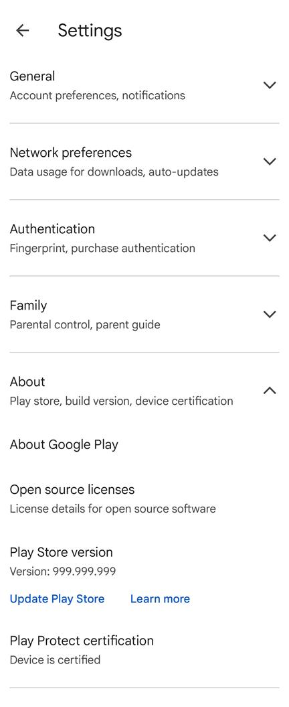
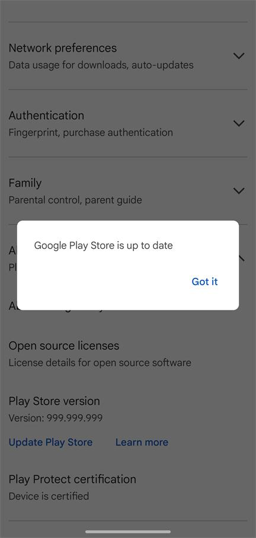

# PlayVersionSpoofer
[中文](README_zh.md) | [English](README.md)

**彻底禁止 Google Play 商店自动更新**

一个阻止 Google Play 商店进行**自我更新**的 Xposed 模块。

## 🚀 功能特点

- 让 Play 商店提示当前已是最新版本
- 仅阻止 Play 商店自我更新，不影响普通应用更新

## 🔍 如何验证 PlayVersionSpoofer 是否正常工作

1. 打开 Google Play 商店
2. 点击右上角的个人资料图标
3. 从菜单中选择"设置"
4. 向下滚动找到"关于"部分
5. 点击 **"更新 Play 商店"**。如果提示 **"Google Play 商店已是最新版本"**，则说明模块工作正常。

  
  &nbsp;&nbsp;&nbsp;&nbsp;
  

> **📝 注意**：如果默认模式不支持某个 Play 商店版本，可在模块应用中开启 **旧版 PackageInfo fallback**，然后强行停止并重新打开 Play 商店。

## 📋 使用要求

- 已 Root 的 Android 设备
- Xposed 框架（推荐 LSPosed）
- Android 9.0+

## 🔧 安装方法

1. 从 [Releases](https://github.com/byemaxx/PlayVersionSpoofer/releases) 下载并安装 APK 文件
2. 在 LSPosed 管理器中启用该模块
3. 选择 "Google Play Store" 作为作用域
4. 打开 PlaySpoofer 应用检查激活状态

## ⚠️ 免责声明

仅用于个人学习目的，使用风险自负。
